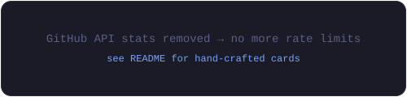
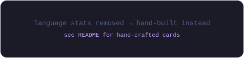
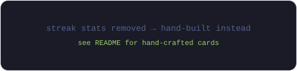

# 👋 Hi, I'm Sadra Maleki

<p align="center">
  
</p>

<p align="center">
  
</p>

### 🧑‍💻 Quick Info

| | |
|---|---|
| 💼 **Role** | Web Developer |
| 📍 **Location** | Iran 🇮🇷 |
| 🏢 **Company** | Freelance · Self-Employed |
| 🎓 **Education** | University of Bonab |
| 🟢 **Status** | Open to collaboration |

**⚙️ Stack** — React · Next.js · NestJS · Node.js · PostgreSQL  
**🎯 Focus** — Frontend Architecture · Product Thinking · System Design  
**🚀 Mission** — Turning ideas into products that solve real problems

## 🚀 About Me

I enjoy working across the **entire product development journey** — from understanding requirements and analyzing systems, to designing databases, building backend services, crafting modern user interfaces, and deploying applications.

Every project is an opportunity to improve not only the software itself, but also the way people interact with it.

<table>
<tr>
<td width="50%" valign="top">

### 🎯 What I Focus On
- 🧠 **Frontend Architecture** — scalable, component-driven design
- 💡 **Product Thinking** — solving the *right* problem, not just any problem
- 🎨 **User Experience** — turning raw ideas into intuitive interfaces
- 🏗️ **System Design** — from database schema to deployment

</td>
<td width="50%" valign="top">

### ⚡ How I Work
- 🚀 Fast learner — exploring new tech, refining ideas
- 🤝 Believe in **collaboration** and **thoughtful design**
- 🔄 **Constant iteration** — in software and in myself
- 📈 Growing from *building software* to *leading its development*

</td>
</tr>
</table>

> *I'm not trying to look like a senior engineer today — I'm focused on becoming one through continuous learning, real-world experience, and building meaningful products.*

---

## 🛠️ Tech Stack

### 🎨 Frontend
<p>
  
  
  
  
</p>

### ⚙️ Backend & Database
<p>
  
  
  
  
  
</p>

### 🧰 Tools
<p>
  
  
</p>

---

## 💼 Experience

| 💼 Role | 🏢 Where | 🔍 Focus |
|---------|----------|----------|
| **Web Developer** | Freelance \| Self-Employed | Frontend architecture, full product development |
| **Teaching Assistant** | University of Bonab | Academic support, mentoring, code review |

---

## 🌟 What Drives Me

```
Understand → Analyze → Design → Build → Deploy → Improve
```

---

## 📊 GitHub Stats

<!-- STATS_START -->
<p align="center">
  
  
</p>

<p align="center">
  
</p>
<!-- STATS_END -->

---

## 📫 Let's Connect

<p>
  <a href="https://github.com/sadramaleki"></a>
  <a href="https://linkedin.com/in/sadramaleki"></a>
</p>

---

<p align="center">
  <i>⭐ Building meaningful products, one commit at a time.</i>
</p>
